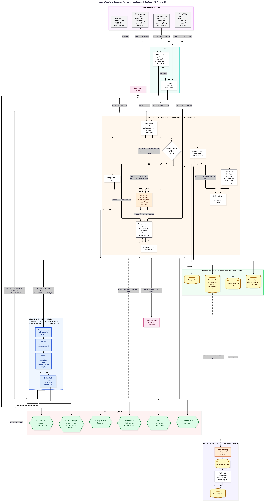

# Scope and architecture specification

Later milestones amend this document rather than replace it. Record each amendment in the [change log](#14-change-log).

## 1. Problem and users

Households in Madina, Accra, cannot get waste collected reliably. Formal waste companies run fixed routes that miss whole streets. Informal aboboyaa (tricycle) riders fill part of the gap, but nothing confirms a rider is available, agrees a fair outcome, or proves a pickup happened. Households with sorted plastic have no dependable way to be rewarded for it. Recyclers receive mixed, contaminated material.

Users:

- **Households** that need reliable collection or want to earn from recycling.
- **Registered tricycle riders**, many without smartphones, who need steady, verifiable work.

## 2. What the system does

One app with two offerings that share riders and backend.

| Offering | Behaviour |
| --- | --- |
| Coordinated waste collection | A household requests a paid pickup with clear scheduling and a flat fee. Payment is authorised at request and debited only when the household confirms the pickup with a PIN. |
| Gamified plastic collection | A household submits sorted plastic. It is weighed and verified, then earns points redeemable as vouchers at partner shops. Neighbourhood leaderboards rank households by points to encourage participation. |

## 3. Where learning is used

| Decision | Approach | Reason |
| --- | --- | --- |
| Waste verification | Learned classifier | No rule separates clean plastic from contaminated or wrong-type waste, or catches a reused photo. Fixed rules are easy to game for people paid on the outcome. |
| Rider dispatch | Rule: nearest available rider | The pilot fleet is 5 to 10 riders and no trip history exists. The pilot generates the data a learned router would need. Learned routing is a Level 3 (stretch) goal, after the Level 1 core and Level 2 extensions. |

## 4. Intelligent experience

The classifier runs at the point of collection on a photo taken by the household or the rider. Its output is never shown as a raw score. It resolves to one of the outcomes below, which the rider sees.

| Outcome | Trigger | Behaviour |
| --- | --- | --- |
| Accept | High confidence the item qualifies | Price or points released once the household PIN confirms the pickup. |
| Defer to rider | Confidence in a middle band | The rider inspects the material and decides. The decision is logged with photo and timestamp, and audited before any use in retraining. |
| Reject | Confident the item does not qualify, or a duplicate photo is detected | The household is told why in plain terms. No charge and no points for that item. |
| Escalate to supervisor | Recurring low confidence on one household, a high override rate for one rider, or a household complaint | A supervisor reviews the logged photo and decision and can reverse it. |

A mismatch at pickup takes one of two paths. A location mismatch is resolved by a phone call between rider and household. A material mismatch goes through verification, which applies mainly to plastic weighed for points.

**Thresholds.** Confidence thresholds separate accept, defer and reject. Escalation is triggered by patterns and complaints, not by a single confidence score. Thresholds are calibrated once a labelled pilot dataset exists, expected in Prosit 2. The operating point minimises expected cost, `C_FA · FA(τ) + C_FR · FR(τ)`, where C is the cost of each error and FA, FR are the error rates at threshold τ. It sits nearer the side of the costlier error. That is expected to be the false accept, because it costs money directly.

## 5. Success criteria

| Level | Criterion | Target, end of Q1 |
| --- | --- | --- |
| Organisational | Active users | 100 |
| Organisational | Sorted plastic collected | 10 tonnes |
| Leading indicator | Request to completed pickup | Within 2 hours |
| User | Reliable collection | Collected and confirmed without dispute |
| User | Fair reward | Points match what was verified |
| Model | False-accept rate (fraud let through) and false-reject rate (honest submissions turned away), tracked separately | Set once labelled pilot data exists |

The two error rates stay separate because blended accuracy can rise while the false-accept rate rises too, increasing fraudulent payouts and degrading material reaching recyclers.

## 6. Cost of failure and recourse

| Party | Cost when the system is wrong | Recourse |
| --- | --- | --- |
| Household | Time lost on a missed pickup. A wrongly rejected submission. | The payment authorisation is released if no pickup happens. A dispute or refund flow is tied to the completion record. A complaint about a rejection goes to the supervisor queue, and points are issued retroactively if the rejection is overturned. |
| Rider | Unpaid time on a missed or wrong-location trip. No insurance for accidents or damage. | None. An uncompensated risk accepted for the pilot. |
| Operator | Fraudulent payouts. Contaminated loads reaching recyclers. | Audit sampling and supervisor review. |

Households and riders bear these costs. The thresholds, the escrow model and the lack of rider insurance are design choices owned by the team and any future operator.

## 7. Out of scope

| Excluded | Reason |
| --- | --- |
| IoT tracking hardware | A procurement and maintenance dependency. Phone GPS and USSD self-report cover the core loop. |
| Tricycle micro-financing | A financial product, not a computing system. |
| Learned, demand-aware routing | No historical demand data. See section 3. |

In scope: the verification classifier, the escrow-based paid pickup, and the points and leaderboard flow.

## 8. Architecture

Mermaid source: [architecture.mmd](architecture.mmd).

- **Clients.** A PWA for households and smartphone riders. A USSD/SMS gateway (mNotify) for feature-phone riders and household PIN confirmation.
- **One backend.** Request intake, rule-based dispatcher, notification service, verification orchestrator, decision policy, escrow and points ledger, complaints, and the supervisor review queue. The backend makes every payment and points decision, using the classifier output as one input alongside the escrow state.
- **Data stores.** Request and photo store, ledger, personal data, and the decision and override log. Personal data is handled under the Data Protection Act, 2012 (Act 843).
- **Offline training loop.** Outside the request path. Only supervisor-audited labels feed retraining. Model versions deploy from a registry.

### Learned component boundary

| Direction | What crosses | Form | Controlled by |
| --- | --- | --- | --- |
| In | Photo and request metadata (request ID, declared waste type) | Image plus structured fields | Backend, via the verification orchestrator |
| Out | Decision and confidence | `accept`, `reject` or `uncertain` (maps to Defer to rider), plus a confidence score | Backend, which applies the decision policy |

Payment and identity data never cross the boundary. The classifier never issues a payment or points instruction.

## 9. Failure modes

Fraud controls: escrow captured only on household PIN confirmation, branded collection bags, and USSD-based dispatch.

| What fails | User sees | Detected by | System does meanwhile |
| --- | --- | --- | --- |
| Classifier confidently wrong: false accept | A normal accepted outcome | Supervisor audit sampling, or contamination reported by a recycling partner | None at the time. Caught later by audit sampling. |
| Classifier confidently wrong: false reject | A legitimate submission declined | Household dispute, and dispute patterns per household | Supervisor review against the logged photo. Points or payment issued retroactively if overturned. |
| Classifier unavailable or times out | No verification result at pickup | Backend call error or timeout | Manual review. Never auto-accept or auto-reject. |
| USSD/SMS gateway unreachable | Feature-phone rider gets no job | Missing or failed delivery-status callback | Retry, then mark the rider unreachable and reassign. |
| Rider marks completed without visiting | Household charged with no pickup | Household dispute, or no household confirmation (PIN or photo) | Escrow is not captured without the PIN. |
| Household and rider collude on a fake completion | Nothing unusual | Only statistical patterns later, such as fast completions or repeat pairings | Nothing at the time. Known blind spot, see section 13. |

## 10. Operational dependencies

- mNotify for SMS and USSD delivery.
- A payment provider for escrow authorisation, capture and release. Not yet chosen.
- Supervisor capacity for escalations, disputes and audit sampling.
- Recycling partners for downstream contamination reports.

## 11. Data

| Data | Current state | Plan |
| --- | --- | --- |
| Waste photos | No local labelled dataset. Public datasets do not reflect Ghanaian waste, packaging or lighting. | Collect and label pilot photos from real pickups in Madina in the first weeks of Prosit 2. Expect noisy images. Labelling capacity is limited to the team. |
| Trips and demand | No historical data. | The rule-based dispatcher generates it during the pilot. |
| Personal data | Phone numbers, household addresses and locations, and rider GPS traces. | Consent flows for households and riders, plus a retention and access policy, before the pilot. Disclose that a household's number is shared with the rider for location calls. |

## 12. Measurement and monitoring stub

Each signal maps to a point on the architecture diagram (S1 to S6).

| Signal | What it shows | Hook |
| --- | --- | --- |
| S1 Confidence distribution over time, per waste type | Drift, or a shifting attack pattern | Classifier output, on every decision returned to the backend |
| S2 Override rate per rider | Leniency drift, or a rider under pressure from households | Decision policy, before the ledger |
| S3 False-accept and false-reject rates from audited samples | Whether the threshold costs more in fraud or in wrongly rejected households | Supervisor review queue, compared with the classifier's original decision |
| S4 Dispute rate and outcome | Loss of trust in an outcome type, or a rider or area with excess disputes | Escrow and points ledger, where disputes attach to transactions |
| S5 USSD/SMS delivery and response rate | The dispatch channel failing silently | USSD/SMS gateway delivery-status callback |
| S6 Time to completion per pickup | Missing the 2-hour target by area or time of day | Dispatch time at the dispatcher to completion time at the ledger |

Confident false accepts and collusion fire none of these signals on a single transaction. They surface only as statistical anomalies across many transactions, so audit sampling at the supervisor queue is their only control.

## 13. Known blind spots

- **Household and rider collusion.** The PIN and photo are real and both parties confirm. No signal fires on a single transaction, and there is no concrete plan yet for surfacing the pattern.
- **Slow override drift.** S2 alerts on the level of a rider's override rate, not its rate of change. A slow climb can stay under the escalation threshold.
- **Adversarial photo edits.** Small changes to a genuine photo could flip a decision. Monitoring cannot tell this apart from ordinary model uncertainty.

## 14. Change log

| Milestone | Change |
| --- | --- |
| M1 | Initial scope and architecture. Decisions: rule-based dispatch, pickup mismatch split into location and material cases, separate false-accept and false-reject rates. |
